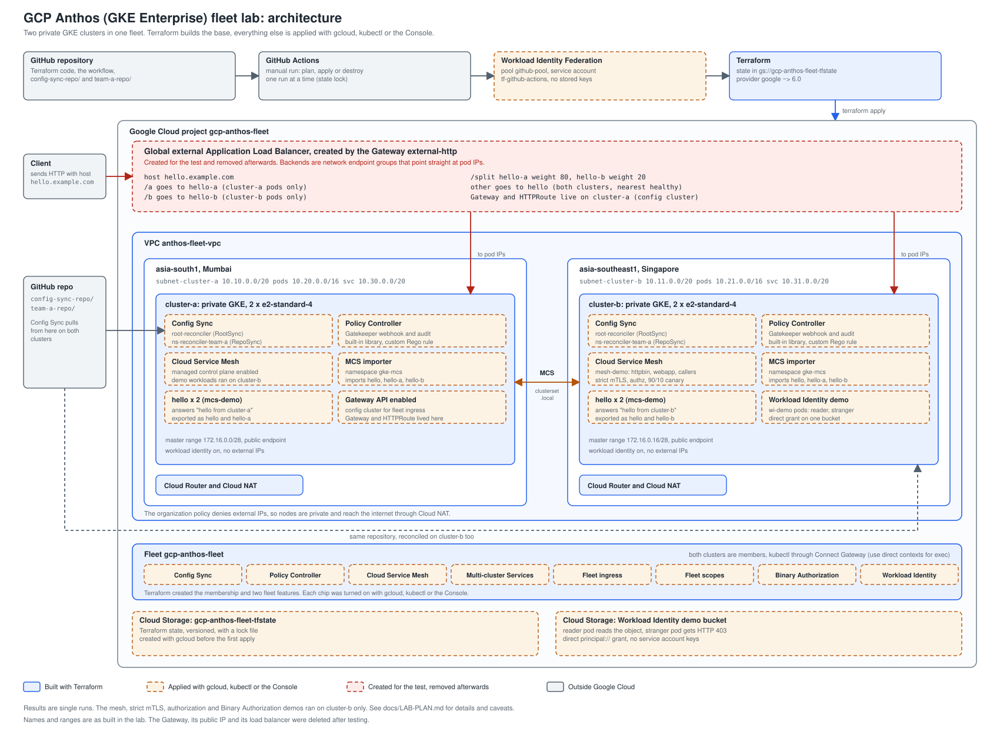

<div align="center">

# ☸️ GCP Anthos (GKE Enterprise) Fleet Lab

### Two Private GKE Clusters · One Fleet · Config Sync · Policy Controller · Service Mesh · Multi-Cluster Gateway

[](https://www.terraform.io)
[](https://cloud.google.com/kubernetes-engine)
[](https://cloud.google.com/kubernetes-engine/fleet-management/docs)
[](https://cloud.google.com/kubernetes-engine/config-sync/docs)
[](https://cloud.google.com/kubernetes-engine/policy-controller/docs)
[](https://cloud.google.com/service-mesh/docs)
[](.github/workflows/terraform.yml)

---

*A hands-on lab that answers one question: what can you actually do with Anthos
(now GKE Enterprise) on a GCP free trial? Two private GKE clusters in Mumbai and
Singapore are built with Terraform, registered to one fleet, and then used to
try GitOps, policy as code, a managed service mesh, multi-cluster services, a
global multi-cluster Gateway, keyless workload identity and more. This README
records what was built, what was measured, and where things went wrong.*

</div>

---

## 🔗 Quick Links

- 🗺️ [Lab plan, status and measured results](docs/LAB-PLAN.md)
- 🏛️ [Architecture](#-architecture)
- 📏 [Measured results](#-measured-results)
- 🔧 [Real deployment gotchas](#-real-deployment-gotchas)
- 🧹 [Teardown](#-teardown)
- 🚧 [Known limitations](#-known-limitations)

---

## 📋 Table of Contents

- [Overview](#-overview)
- [Why a Fleet](#-why-a-fleet)
- [Architecture](#-architecture)
- [What It Does](#-what-it-does)
- [Repository Structure](#-repository-structure)
- [Prerequisites](#-prerequisites)
- [Setup](#-setup)
- [Testing and Verification](#-testing-and-verification)
- [Measured Results](#-measured-results)
- [Real Deployment Gotchas](#-real-deployment-gotchas)
- [Security and Governance](#-security-and-governance)
- [Cost](#-cost)
- [Teardown](#-teardown)
- [Snapshots](#-snapshots)
- [Known Limitations](#-known-limitations)
- [Documentation](#-documentation)
- [Repository](#-repository)

---

## 🌐 Overview

Anthos was Google Cloud's hybrid and multi-cloud platform. Today the name mostly
survives in older documentation: the platform is sold as **GKE Enterprise**,
service mesh is **Cloud Service Mesh**, and running GKE on your own hardware is
**Google Distributed Cloud**. The concepts that matter, a **fleet** of clusters
managed as one unit, are all still there.

This lab builds a small but real fleet on a free trial account and exercises it.
There is no application to ship. The deliverable is the infrastructure, the
fleet features, and a record of how each one behaved.

> ⚠️ **A note on honesty.** Every number in this repo comes from a single run on
> one trial project, usually with samples 20 seconds or more apart. The mesh,
> strict mTLS, authorization and Binary Authorization demos ran on **cluster-b
> only**. Several things were set up with `gcloud` or `kubectl` and not with
> Terraform, and the repo says which. Where something was not verified, or its
> cause was not found, it is written down as such. See
> [Known Limitations](#-known-limitations).

### 🔑 Key Facts

| Property | Value |
|---|---|
| ☁️ **Cloud platform** | Google Cloud Platform, free trial account |
| ☸️ **Clusters** | 2 private GKE clusters, `cluster-a` (asia-south1-a, Mumbai) and `cluster-b` (asia-southeast1-a, Singapore), 2 × e2-standard-4 nodes each |
| 🌐 **Network** | Custom VPC `anthos-fleet-vpc`, VPC-native subnets, Cloud NAT in both regions, no external node IPs |
| 🧭 **Fleet** | Both clusters registered as members of the fleet in `gcp-anthos-fleet`; kubectl access through Connect Gateway |
| 🔁 **GitOps** | Config Sync: one `RootSync` (cluster-wide) and one `RepoSync` (namespace `team-a`) |
| 📜 **Policy** | Policy Controller (OPA Gatekeeper) with the built-in library, two repo constraints and one custom Rego template |
| 🕸️ **Mesh** | Cloud Service Mesh, managed control plane (`TRAFFIC_DIRECTOR` implementation), revision `asm-managed` |
| 🔀 **Multi-cluster** | Multi-cluster Services (MCS) and a global external multi-cluster Gateway (`gke-l7-global-external-managed-mc`) |
| 🪪 **Identity** | Workload Identity Federation for GKE, direct `principal://` grants, no service account keys |
| 🧱 **Supply chain** | Binary Authorization, dry-run mode only |
| 🏗️ **IaC** | Terraform (provider `google ~> 6.0`), state in a versioned GCS bucket |
| 🔐 **CI/CD** | GitHub Actions with keyless Workload Identity Federation, manual plan / apply / destroy |

---

## 🧭 Why a Fleet

Once you run more than one cluster, the same questions repeat for each one: is
the same config on every cluster, is the same policy enforced, can services find
each other across regions, and who can touch what. A **fleet** answers them
with one control surface:

- 🔁 **Same config everywhere**: Config Sync reads one Git repo and reconciles it into every member cluster.
- 📜 **Same guardrails everywhere**: Policy Controller admits or rejects objects against shared constraints.
- 🕸️ **Same identity and encryption between services**: the mesh issues workload certificates and enforces mTLS and authorization.
- 🔀 **Services that span regions**: MCS and the multi-cluster Gateway expose one service backed by pods in several clusters.
- 👥 **Team boundaries**: fleet scopes and fleet namespaces give a team its slice of the fleet.

This lab uses `cluster-b` as a stand-in for a "remote" environment. Real on-prem
hardware is not available in a free trial, so Google Distributed Cloud and
attached clusters are covered as theory only.

---

## 🏛️ Architecture



> Borders show how each part was built: solid blue for Terraform, dashed amber for gcloud, kubectl or the
> Console, dashed red for resources created only for the test and removed afterwards. The Gateway
> resources lived on the config cluster (`cluster-a`).

<details>
<summary>Prefer plain text? Expand for the ASCII diagrams</summary>

### 1. Delivery, network and clusters

```
┌──────────────────────────────────────────────────────────────────────────────────────────────────┐
│ DELIVERY                                                                                         │
├──────────────────────────────────────────────────────────────────────────────────────────────────┤
│ GitHub repo  ->  GitHub Actions (manual dispatch: plan | apply | destroy)                        │
│ keyless auth: Workload Identity Federation (github-pool)  ->  service account tf-github-actions  │
│ Terraform state: gs://gcp-anthos-fleet-tfstate  (versioned, locked)                              │
└──────────────────────────────────────────────────────────────────────────────────────────────────┘
                                                  │   terraform apply
                                                  ▼
┌───────────────────────────────────────────────┬──────────────────────────────────────────────────┐
│ NETWORK  VPC anthos-fleet-vpc                 │ (custom mode, VPC-native)                        │
├───────────────────────────────────────────────┼──────────────────────────────────────────────────┤
│ asia-south1 (Mumbai)                          │ asia-southeast1 (Singapore)                      │
│ subnet-cluster-a  10.10.0.0/20                │ subnet-cluster-b  10.11.0.0/20                   │
│ pods 10.20.0.0/16 | services 10.30.0.0/20     │ pods 10.21.0.0/16 | services 10.31.0.0/20        │
│ Cloud Router + Cloud NAT                      │ Cloud Router + Cloud NAT                         │
└───────────────────────────────────────────────┴──────────────────────────────────────────────────┘
┌──────────────────────────────────────────────────────────────────────────────────────────────────┐
│ No external IPs: org policy compute.vmExternalIpAccess = DENY, so nodes are private (Cloud NAT)  │
└──────────────────────────────────────────────────────────────────────────────────────────────────┘
                                                  │
                                                  ▼
┌───────────────────────────────────────────────┬──────────────────────────────────────────────────┐
│ cluster-a  (asia-south1-a)                    │ cluster-b  (asia-southeast1-a)                   │
├───────────────────────────────────────────────┼──────────────────────────────────────────────────┤
│ private GKE, 2 x e2-standard-4                │ private GKE, 2 x e2-standard-4                   │
│ public control-plane endpoint                 │ public control-plane endpoint                    │
│ master range 172.16.0.0/28                    │ master range 172.16.0.16/28                      │
│ workload identity enabled                     │ workload identity enabled                        │
│ config cluster for fleet ingress              │ mesh demo workloads run here                     │
└───────────────────────────────────────────────┴──────────────────────────────────────────────────┘
                                                  │
                                                  ▼
┌──────────────────────────────────────────────────────────────────────────────────────────────────┐
│ FLEET  gcp-anthos-fleet                                                                          │
├──────────────────────────────────────────────────────────────────────────────────────────────────┤
│ both clusters are members; kubectl through Connect Gateway (direct contexts needed for exec)     │
└──────────────────────────────────────────────────────────────────────────────────────────────────┘
```

### 2. Fleet features

```
┌──────────────────────────────────────────────────────────────────────────────────────────────────┐
│ GITOPS   Config Sync                                                                             │
├──────────────────────────────────────────────────────────────────────────────────────────────────┤
│ RootSync  root-sync   <-  github.com/bikram-singh/gcp-anthos-fleet   dir config-sync-repo/       │
│ RepoSync  repo-sync   <-  same repo, dir team-a-repo/, limited to namespace team-a               │
├──────────────────────────────────────────────────────────────────────────────────────────────────┤
│ POLICY   Policy Controller (OPA Gatekeeper)                                                      │
├──────────────────────────────────────────────────────────────────────────────────────────────────┤
│ built-in template library and policy bundle (dryrun)                                             │
│ constraints from Git: no-privileged-containers (deny), pods-must-have-app-label (dryrun)         │
│ custom Rego template K8sRequireOwner + constraint configmaps-need-owner (deny, ns policy-lab)    │
├──────────────────────────────────────────────────────────────────────────────────────────────────┤
│ MESH     Cloud Service Mesh (managed, TRAFFIC_DIRECTOR control plane, revision asm-managed)      │
├──────────────────────────────────────────────────────────────────────────────────────────────────┤
│ sidecar injection, strict mTLS, AuthorizationPolicy, VirtualService weights                      │
│ demo workloads in namespace mesh-demo on cluster-b: httpbin, webapp, three callers               │
├──────────────────────────────────────────────────────────────────────────────────────────────────┤
│ MULTI-CLUSTER   Multi-cluster Services + fleet ingress                                           │
├──────────────────────────────────────────────────────────────────────────────────────────────────┤
│ ServiceExport / ServiceImport, names under *.svc.clusterset.local                                │
│ fleet ingress: config cluster = cluster-a  ->  Gateway class gke-l7-global-external-managed-mc   │
├──────────────────────────────────────────────────────────────────────────────────────────────────┤
│ IDENTITY AND SUPPLY CHAIN                                                                        │
├──────────────────────────────────────────────────────────────────────────────────────────────────┤
│ Workload Identity Federation for GKE: direct principal:// grants, no service account keys        │
│ Binary Authorization in dry-run mode (audit log only)                                            │
├──────────────────────────────────────────────────────────────────────────────────────────────────┤
│ TEAMS    Fleet scopes                                                                            │
├──────────────────────────────────────────────────────────────────────────────────────────────────┤
│ scope team-checkout, membership bindings, fleet namespace checkout-ns on both clusters           │
└──────────────────────────────────────────────────────────────────────────────────────────────────┘
```

### 3. GitOps and policy flow

```
┌──────────────────────────────────────────────────────────────────────────────────────────────────┐
│ GITHUB  github.com/bikram-singh/gcp-anthos-fleet                                                 │
├──────────────────────────────────────────────────────────────────────────────────────────────────┤
│ config-sync-repo/   namespaces/ (demo, demo-2, default-deny)   policies/ (constraints, template) │
│ team-a-repo/        configmap.yaml  (namespace team-a only)                                      │
└──────────────────────────────────────────────────────────────────────────────────────────────────┘
                                                  │   polled by Config Sync reconcilers
                                                  ▼
┌───────────────────────────────────────────────┬──────────────────────────────────────────────────┐
│ cluster-a                                     │ cluster-b                                        │
├───────────────────────────────────────────────┼──────────────────────────────────────────────────┤
│ root-reconciler   (RootSync root-sync)        │ root-reconciler   (RootSync root-sync)           │
│ ns-reconciler-team-a   (RepoSync, ns team-a)  │ ns-reconciler-team-a   (RepoSync, ns team-a)     │
│ applies: namespaces, NetworkPolicy,           │ applies: namespaces, NetworkPolicy,              │
│   templates, constraints, ConfigMap           │   templates, constraints, ConfigMap              │
└───────────────────────────────────────────────┴──────────────────────────────────────────────────┘
                                                  │   every create/update hits the admission webhook
                                                  ▼
┌──────────────────────────────────────────────────────────────────────────────────────────────────┐
│ POLICY CONTROLLER  (Gatekeeper)                                                                  │
├──────────────────────────────────────────────────────────────────────────────────────────────────┤
│ validation.gatekeeper.sh: deny privileged pods in demo, require an owner label in policy-lab     │
│ audit: periodic scan lists existing violations (for example kube-root-ca.crt, no owner label)    │
│ a RepoSync is limited to its own namespace: a foreign namespace is rejected with KNV1058         │
└──────────────────────────────────────────────────────────────────────────────────────────────────┘
```

### 4. Multi-cluster Gateway traffic

```
┌──────────────────────────────────────────────────────────────────────────────────────────────────┐
│ CLIENT                                                                                           │
├──────────────────────────────────────────────────────────────────────────────────────────────────┤
│ curl -H "host: hello.example.com" http://<gateway public IP>/...                                 │
└──────────────────────────────────────────────────────────────────────────────────────────────────┘
                                                  │
                                                  ▼
┌──────────────────────────────────────────────────────────────────────────────────────────────────┐
│ GLOBAL EXTERNAL APPLICATION LOAD BALANCER  (created by Gateway external-http)                    │
├──────────────────────────────────────────────────────────────────────────────────────────────────┤
│ URL map for host hello.example.com:                                                              │
│   /a       ->  ServiceImport hello-a    (cluster-a pods only)                                    │
│   /b       ->  ServiceImport hello-b    (cluster-b pods only)                                    │
│   /split   ->  hello-a weight 80, hello-b weight 20                                              │
│   other    ->  ServiceImport hello      (both clusters, closest healthy region)                  │
│ Gateway and HTTPRoute live on the config cluster (cluster-a)                                     │
└──────────────────────────────────────────────────────────────────────────────────────────────────┘
                                                  │   container-native: straight to pod IPs (NEGs)
                                                  ▼
┌───────────────────────────────────────────────┬──────────────────────────────────────────────────┐
│ cluster-a  (Mumbai)                           │ cluster-b  (Singapore)                           │
├───────────────────────────────────────────────┼──────────────────────────────────────────────────┤
│ Deployment hello, 2 pods                      │ Deployment hello, 2 pods                         │
│ answers "hello from cluster-a"                │ answers "hello from cluster-b"                   │
│ Service hello, hello-a                        │ Service hello, hello-b                           │
│ ServiceExport hello, hello-a                  │ ServiceExport hello, hello-b                     │
└───────────────────────────────────────────────┴──────────────────────────────────────────────────┘
```

</details>

### 🔄 Layer Breakdown

| Layer | Components |
|---|---|
| 🔐 **Delivery** | GitHub Actions (manual dispatch) → keyless Workload Identity Federation → service account `tf-github-actions` → Terraform with state in GCS |
| 🌐 **Network** | Custom VPC, two VPC-native subnets with pod and service ranges, Cloud Router and Cloud NAT per region |
| ☸️ **Clusters** | Two private GKE clusters, regular release channel, Workload Identity enabled, public control-plane endpoint |
| 🧭 **Fleet** | Membership for both clusters, fleet features enabled, Connect Gateway access |
| 🔁 **GitOps** | Config Sync reconcilers (`root-reconciler`, `ns-reconciler-team-a`) reading this repo |
| 📜 **Policy** | Gatekeeper admission webhook plus audit, templates and constraints delivered through Git |
| 🕸️ **Mesh** | Envoy sidecars, managed control plane, mTLS, authorization policy, weighted routing |
| 🔀 **Multi-cluster** | MCS endpoint sharing, fleet ingress with `cluster-a` as config cluster, global external load balancer with container-native backends |

---

## ✨ What It Does

| Capability | Description |
|---|---|
| 🌐 **Private multi-region clusters** | Two clusters with no external node IPs, outbound access through Cloud NAT, built to satisfy an organization policy that denies external IPs |
| 🧭 **Fleet management** | Both clusters are fleet members; fleet features are enabled once and apply to both |
| 🔁 **GitOps at two scopes** | A RootSync syncs cluster-wide config from `config-sync-repo/`; a RepoSync syncs one namespace (`team-a`) from `team-a-repo/` with its own RBAC |
| 🧯 **Drift correction** | A deleted NetworkPolicy is recreated by Config Sync |
| 🚫 **Admission control** | A privileged pod is rejected by the Gatekeeper webhook on both clusters |
| 🧪 **Custom policy** | A hand-written Rego template (`K8sRequireOwner`) delivered through Git and enforced on ConfigMaps |
| 🔒 **Zero-trust mesh** | Sidecar injection, strict mTLS, an AuthorizationPolicy that allows one workload identity |
| 🐤 **Canary releases** | Weighted routing in the mesh (VirtualService) and at the load balancer (Gateway) |
| 🌍 **Cross-region services** | One service name resolves to pods in both regions through `clusterset.local` |
| 🛣️ **Global Gateway** | Path routing, weighted split and health-based failover across two regions |
| 🪪 **Keyless access to GCP** | A pod reads a Cloud Storage bucket through a direct Workload Identity grant; a second pod without the grant gets HTTP 403 |
| 🧱 **Supply-chain control** | Binary Authorization in dry-run logs what it would block without blocking anything |
| 👥 **Team scopes** | A fleet scope and fleet namespace appear on both clusters from one definition |
| 🔐 **Keyless CI** | Terraform runs in GitHub Actions with no stored cloud keys |

---

## 📁 Repository Structure

```
gcp-anthos-fleet/
│
├── README.md
├── .gitignore
│
├── .github/
│   └── workflows/
│       └── terraform.yml                  # manual: plan | apply | destroy, keyless via WIF
│
├── terraform/
│   ├── providers.tf                       # google ~> 6.0, GCS backend (bucket set at init)
│   ├── variables.tf                       # project, regions and zones, machine type, node count
│   ├── apis.tf                            # enables the required APIs
│   ├── network.tf                         # VPC, two subnets with pod/service ranges
│   ├── nat.tf                             # Cloud Router + Cloud NAT per region
│   ├── clusters.tf                        # two private clusters, node pools, fleet membership
│   ├── fleet.tf                           # fleet features: configmanagement, servicemesh
│   ├── outputs.tf                         # get-credentials commands
│   └── terraform.tfvars.example
│
├── config-sync-repo/                      # reconciled by the RootSync into both clusters
│   ├── namespaces/
│   │   └── demo/
│   │       ├── namespace.yaml
│   │       ├── namespace-2.yaml
│   │       └── default-deny.yaml          # default-deny ingress NetworkPolicy
│   └── policies/
│       ├── no-privileged.yaml             # constraint: deny privileged containers (namespace demo)
│       ├── require-app-label.yaml         # constraint: dryrun, pods need an app label
│       ├── require-owner-template.yaml    # custom ConstraintTemplate written in Rego
│       └── require-owner-constraint.yaml  # custom constraint (namespace policy-lab)
│
├── team-a-repo/                           # reconciled by the RepoSync into namespace team-a
│   └── configmap.yaml
│
├── fleet-config/
│   ├── rootsync.yaml                      # the RootSync applied with kubectl
│   └── apply-spec.yaml                    # fleet-spec route, unused (needs gcloud beta)
│
└── docs/
    ├── LAB-PLAN.md                        # phase plan, status, measured results, caveats
    ├── phases.md                          # short phase outline
    └── diagrams/
        ├── architecture-diagram.svg       # the all-in-one architecture diagram
        └── architecture-diagram.png       # same diagram as PNG (Medium rejects SVG)
```

> The mesh, MCS, Gateway, Workload Identity, Binary Authorization and fleet-scope
> demos were applied directly with `kubectl` and `gcloud`. Their commands are in
> [Setup](#-setup), but their manifests are not stored in this repo.

---

## ✅ Prerequisites

| Requirement | Details |
|---|---|
| ☁️ **GCP project** | Billing enabled. A free trial account worked. You need permission to create IAM, networking, GKE and fleet resources |
| 🧰 **CLIs** | `gcloud` (with `kubectl` and `gke-gcloud-auth-plugin`), and optionally the GitHub CLI `gh` |
| 🏗️ **Terraform** | 1.5 or newer. Not needed locally if you run it through the workflow |
| 🔐 **GitHub** | A public repository (the RootSync reads it with `auth: none`; a private repo needs credentials) |
| 🪟 **PowerShell** | Commands below are PowerShell. Quote and encoding notes are in the [gotchas](#-real-deployment-gotchas) |
| 🏢 **Organization policy** | The build tolerates `constraints/compute.vmExternalIpAccess = DENY`. If your organization differs, you may not need private nodes |

---

## ⚙️ Setup

This is a reference build, not an installer. The order below is the one that
worked. Replace `<PROJECT_NUMBER>` and the repository owner with your own values.

**1. Bootstrap (once, outside Terraform)**

```powershell
$PROJECT_ID = "gcp-anthos-fleet"
$REGION     = "asia-south1"
$BUCKET     = "$PROJECT_ID-tfstate"
$SA_NAME    = "tf-github-actions"
$SA_EMAIL   = "$SA_NAME@$PROJECT_ID.iam.gserviceaccount.com"
$POOL       = "github-pool"
$PROVIDER   = "github-provider"
$GITHUB_REPO = "<owner>/gcp-anthos-fleet"

gcloud services enable serviceusage.googleapis.com cloudresourcemanager.googleapis.com iam.googleapis.com iamcredentials.googleapis.com sts.googleapis.com storage.googleapis.com billingbudgets.googleapis.com
gcloud storage buckets create "gs://$BUCKET" --location=$REGION --uniform-bucket-level-access
gcloud storage buckets update "gs://$BUCKET" --versioning
gcloud iam service-accounts create $SA_NAME --display-name="Terraform via GitHub Actions"

foreach ($role in @("roles/container.admin","roles/compute.networkAdmin","roles/compute.viewer","roles/gkehub.admin","roles/serviceusage.serviceUsageAdmin","roles/iam.serviceAccountUser")) {
  gcloud projects add-iam-policy-binding $PROJECT_ID "--member=serviceAccount:$SA_EMAIL" "--role=$role" --condition=None
}
gcloud storage buckets add-iam-policy-binding "gs://$BUCKET" "--member=serviceAccount:$SA_EMAIL" --role="roles/storage.objectAdmin"

gcloud iam workload-identity-pools create $POOL --location=global --display-name="GitHub Pool"
gcloud iam workload-identity-pools providers create-oidc $PROVIDER --location=global --workload-identity-pool=$POOL `
  --issuer-uri="https://token.actions.githubusercontent.com" `
  "--attribute-mapping=google.subject=assertion.sub,attribute.repository=assertion.repository" `
  "--attribute-condition=assertion.repository=='$GITHUB_REPO'"
gcloud iam service-accounts add-iam-policy-binding $SA_EMAIL --role="roles/iam.workloadIdentityUser" `
  "--member=principalSet://iam.googleapis.com/projects/<PROJECT_NUMBER>/locations/global/workloadIdentityPools/$POOL/attribute.repository/$GITHUB_REPO"

gh secret set WIF_PROVIDER --repo $GITHUB_REPO --body "projects/<PROJECT_NUMBER>/locations/global/workloadIdentityPools/$POOL/providers/$PROVIDER"
gh secret set WIF_SERVICE_ACCOUNT --repo $GITHUB_REPO --body $SA_EMAIL
gh secret set TF_STATE_BUCKET --repo $GITHUB_REPO --body $BUCKET
```

Also create a budget with alerts (budget alerts only send email, they do not stop spending).

**2. Plan, then apply, through the workflow**

```powershell
gh workflow run terraform.yml --repo $GITHUB_REPO -f action=plan
# read the plan output, then run ONE apply and do not start another run while it works
gh workflow run terraform.yml --repo $GITHUB_REPO -f action=apply
```

Apply takes about 15 minutes. Two runs at the same time collide on the state lock.

**3. Confirm the fleet**

```powershell
gcloud container fleet memberships list
gcloud container fleet memberships get-credentials cluster-a --location=asia-south1
kubectl get nodes
```

For `kubectl exec`, use the direct contexts (`gke_<project>_<zone>_<cluster>`), because exec through Connect Gateway returned an error here.

**4. Config Sync (RootSync and RepoSync)**

Install Config Sync in the Console (**Feature manager → Config Sync → Configure**), then apply the RootSync to each cluster. A RepoSync needs a RoleBinding for its reconciler service account:

```powershell
kubectl apply -f fleet-config\rootsync.yaml          # run against each cluster context

# RepoSync for namespace team-a (service account name follows ns-reconciler-<namespace>)
kubectl create namespace team-a
# RoleBinding: subject ServiceAccount ns-reconciler-team-a (namespace config-management-system) -> ClusterRole edit
# RepoSync name repo-sync, git.dir team-a-repo, auth none
```

Write repo files without a byte-order mark. One invisible BOM blocked the entire sync once.

**5. Policy Controller**

Enable it per cluster, with `--location`. The fleet-wide form failed with an internal error:

```powershell
gcloud container fleet policycontroller enable --memberships=cluster-a --location=asia-south1
gcloud container fleet policycontroller enable --memberships=cluster-b --location=asia-southeast1
kubectl get constrainttemplates      # the library appears after a few minutes
```

Constraints and the custom template then arrive through Config Sync from `config-sync-repo/policies/`.

**6. Cloud Service Mesh (managed)**

```powershell
gcloud container fleet mesh update --management automatic --memberships=cluster-a --location=asia-south1
gcloud container fleet mesh update --management automatic --memberships=cluster-b --location=asia-southeast1
gcloud container fleet mesh describe      # wait until control plane and data plane are ACTIVE
kubectl label namespace mesh-demo istio.io/rev=asm-managed
```

Changes to mesh config took minutes to reach running proxies. Restart the target pods after applying policies.

**7. Multi-cluster Services and the Gateway**

```powershell
gcloud services enable multiclusterservicediscovery.googleapis.com trafficdirector.googleapis.com dns.googleapis.com multiclusteringress.googleapis.com
gcloud container fleet multi-cluster-services enable

# importer permission: use the principal:// member format
gcloud projects add-iam-policy-binding <PROJECT_ID> `
  "--member=principal://iam.googleapis.com/projects/<PROJECT_NUMBER>/locations/global/workloadIdentityPools/<PROJECT_ID>.svc.id.goog/subject/ns/gke-mcs/sa/gke-mcs-importer" `
  --role=roles/compute.networkViewer

# Gateway API on the clusters, BEFORE enabling fleet ingress
gcloud container clusters update cluster-a --gateway-api=standard --location=asia-south1-a
gcloud container clusters update cluster-b --gateway-api=standard --location=asia-southeast1-a

gcloud container fleet ingress enable --config-membership=projects/<PROJECT_ID>/locations/asia-south1/memberships/cluster-a
gcloud projects add-iam-policy-binding <PROJECT_ID> `
  "--member=serviceAccount:service-<PROJECT_NUMBER>@gcp-sa-multiclusteringress.iam.gserviceaccount.com" --role=roles/container.admin
```

Then export Services with `ServiceExport` (apiVersion `net.gke.io/v1`), and create a `Gateway` of class `gke-l7-global-external-managed-mc` plus an `HTTPRoute` whose `backendRefs` point at `ServiceImport` objects. A new Gateway took about ten minutes to serve traffic.

**8. Extras**

| Extra | Key commands |
|---|---|
| 🪪 **Workload Identity** | Grant `roles/storage.objectViewer` on a bucket to `principal://iam.googleapis.com/projects/<PROJECT_NUMBER>/locations/global/workloadIdentityPools/<PROJECT_ID>.svc.id.goog/subject/ns/<NAMESPACE>/sa/<KSA>` |
| 🧱 **Binary Authorization** | `gcloud container clusters update <cluster> --binauthz-evaluation-mode=PROJECT_SINGLETON_POLICY_ENFORCE`, then import a policy with `evaluationMode: ALWAYS_DENY` and `enforcementMode: DRYRUN_AUDIT_LOG_ONLY` |
| 👥 **Fleet scopes** | `gcloud container fleet scopes create`, `gcloud container fleet memberships bindings create`, `gcloud container fleet scopes namespaces create` |

---

## 🧪 Testing and Verification

There is **no automated test suite** in this repo. Verification is done against live GCP:

```powershell
# Fleet and clusters
gcloud container fleet memberships list
gcloud container fleet features list
kubectl get nodes -o wide                              # EXTERNAL-IP shows <none>

# GitOps
kubectl get rootsync,reposync -A                       # SYNCCOMMIT equals SOURCECOMMIT, no errors

# Policy
kubectl get constraints
kubectl get k8srequireowner
kubectl apply -f <privileged-pod.yaml>                 # expect: admission webhook denied the request

# Mesh
gcloud container fleet mesh describe                   # control plane and data plane ACTIVE
kubectl get pods -n mesh-demo                          # 2/2 containers

# Multi-cluster
gcloud container fleet multi-cluster-services describe
gcloud container fleet ingress describe                # Ready to use
kubectl get gatewayclasses                             # the -mc classes exist
```

Always read counts and statuses with a retry loop after a change: this
environment needed minutes to settle (see the gotchas).

---

## 📏 Measured Results

All figures are **single runs** with samples at least 20 seconds apart. Treat timings as approximate.

| Area | Result |
|---|---|
| 🏢 **Org policy** | Effective `compute.vmExternalIpAccess` is `allValues: DENY`; creating a plain VM was rejected with `Constraint ... violated` |
| 🧯 **Drift correction** | A deleted NetworkPolicy was recreated within about a minute (cluster-b) |
| 🔁 **RepoSync scope** | A file with `namespace: demo` in the team repo was rejected with `KNV1058`; the sync stayed at the last good commit and recovered once the file was removed |
| 🚫 **Policy deny** | Privileged pod rejected by `no-privileged-containers` on both clusters |
| 🧪 **Custom template** | Unlabeled ConfigMap denied on both clusters; the audit flags the existing `kube-root-ca.crt` ConfigMap |
| 🔒 **Strict mTLS** | A caller outside the mesh was rejected (curl exit code 56) |
| 🛂 **AuthorizationPolicy** | `sleep-allowed` 200, `sleep-denied` 403, default-service-account `client` 403, outside caller rejected |
| 🐤 **Mesh canary** | Baseline 49 / 51; configured 90/10 measured **447 / 53** over 500 requests (an earlier 100-request sample gave 82 / 18) |
| 🌍 **MCS** | A pod in Mumbai reached a service in Singapore by `clusterset.local` name; merged endpoints gave 53 / 47; with cluster-b scaled to zero, 50 of 50 answers came from cluster-a |
| 🛣️ **Gateway routing** | `/a` answered by cluster-a, `/b` by cluster-b; the default path went to cluster-a for a client in India (70 of 70) |
| 🔁 **Gateway failover** | With cluster-a at zero: one 503, then cluster-b answered by the next sample; after restoring, traffic returned to cluster-a within about 30 seconds of its pods being ready |
| ⚖️ **Gateway split** | Configured 80/20 measured **157 / 43** and **156 / 44** over 200 requests each |
| 🪪 **Workload Identity** | `reader` printed the bucket object; `stranger` got HTTP 403 (`storage.objects.get` denied) |
| 🧱 **Binary Authorization** | Pod admitted; the log entry says `'nginx' : Denied by an ALWAYS_DENY admission rule` |
| 🔑 **Least-privilege nodes** | A temporary 1-node pool using a minimal service account became Ready in under a minute and ran a pod. Log and metric delivery was not verified |
| 👥 **Fleet scopes** | `checkout-ns` appeared on both clusters with a `fleet.gke.io/fleet-scope` label |

---

## 🔧 Real Deployment Gotchas

Most write-ups skip this part. Each row happened in this lab.

| Gotcha | Symptom | Fix |
|---|---|---|
| 🌐 **Org policy denies external IPs** | Node creation fails with `Constraint constraints/compute.vmExternalIpAccess violated` | Private nodes plus Cloud NAT |
| 🔒 **Two runs, one state lock** | `Error acquiring the state lock` (HTTP 412) | One workflow run at a time; clear a stale lock only after confirming nothing is running |
| 📝 **The fix was never committed** | The next run behaved like the old code; the commit contained only an error log | Check `git show --stat HEAD` before pushing |
| 🛑 **Cancelling a destroy does not stop it** | Node pools and fleet features were deleted after the cancel | Never cancel; wait for operations, clear the lock, plan, apply |
| 🧬 **Invisible BOM breaks Config Sync** | `KNV2010: missing field "apiVersion"`, whole sync blocked | Write repo files without a BOM (`Set-Content -Encoding utf8` in Windows PowerShell 5.1 adds one) |
| 🧰 **`gcloud beta` needs admin to install** | `Invalid choice: 'apply'` / `'status'` in the GA group | RootSync with `kubectl`; use `fleet config-management describe` for the fleet view |
| 📜 **Policy Controller fleet-wide enable** | `an internal error has occurred`, then `membership not found` | Enable per membership with `--location` |
| 🔌 **`kubectl exec` via Connect Gateway** | HTTP 400 | Use the direct `gke_...` contexts |
| ⏳ **Mesh config propagation** | Tests right after applying gave 503s and policies that did not apply | Wait minutes; restart the target pods |
| 🧩 **Subset-based DestinationRule** | `webapp` returned 503 | The same split written with two Services and a VirtualService worked. Root cause not found |
| 🪪 **Wrong IAM member format for MCS** | ClusterSetIP refused connections (curl exit 7), no endpoint slices | The documented `principal://...` binding plus an importer restart |
| 🛣️ **New Gateway is slow** | Connection reset, then 502, then 200 | Wait about ten minutes; test with a retry loop |
| ⏱️ **Route changes lag** | Stale rules gave 200 of 200 from one cluster, then 200 of 200 from the other | Wait minutes before judging weights; re-measure with 200 or more requests |
| 🗃️ **Cloud DNS zones missing** | The docs say MCS creates zones; the project had none | Recorded as an observed difference |
| 🪟 **PowerShell quoting** | jsonpath templates with double quotes, indented here-strings and `>` redirects broke commands or file encoding | Single-quoted templates, here-strings starting at column 1, `WriteAllText` with a BOM-less UTF-8 encoder |
| ↩️ **Lone carriage return in a file** | Git treated a doc as non-text and committed it whole | Match `[^\r\n]*` in regex edits and check `git diff --stat` before committing |

---

## 🛡️ Security and Governance

| Control | Implementation |
|---|---|
| 🌐 **No external node IPs** | Private nodes, outbound via Cloud NAT; the organization policy was verified with the effective policy and a rejected VM |
| 🔐 **Keyless CI** | Workload Identity Federation limited to this repository; no downloaded service account keys |
| 🪪 **Keyless workload access** | Direct Workload Identity grants (`principal://...`) to a Kubernetes service account on one bucket |
| 🔒 **Mesh identity** | Workload certificates from Google's CA; strict mTLS in a namespace |
| 🛂 **Service-level authorization** | `AuthorizationPolicy` allowing one workload identity to call `httpbin` |
| 🚫 **Admission control** | Gatekeeper webhook denying privileged containers; a custom Rego rule requiring an owner label |
| 🧱 **Supply chain** | Binary Authorization dry-run (audit only) |
| 🔭 **Posture** | Security Posture feature enabled on both clusters |
| 👥 **Team boundaries** | RepoSync limited to its namespace (`KNV1058`); fleet scope with a fleet namespace |
| 🔑 **Least-privilege nodes** | Validated on a temporary pool only; the primary pools still use the Compute Engine default service account, which has no direct role bindings at project or organization level (deny policies and group-based access were not checked) |
| 💰 **Budget guardrail** | A budget with alerts. Alerts only email |

---

## 💰 Cost

Cost depends on how long the clusters, nodes, NAT and load balancer run, so read
the real figure from Billing instead of estimating.

| Item | Value |
|---|---|
| 🎟️ **Trial credit at the start** | ₹7,869 remaining of ₹28,694 (Billing page) |
| 🧾 **Trial banner on 3 Oct 2026** | ₹6,750.95, a drop of ₹1,118.05. This is a billing-account figure that lags behind usage, so it is **not** the project's cost |
| 📊 **Real total spend** | _To fill in: Billing → Reports, project `gcp-anthos-fleet`, gross cost before credits. Read it after teardown and again about a day later, because billing data lags_ |

Main running costs were the two clusters' nodes and fees, plus Cloud NAT and, while it existed, the Gateway's load balancer. Multi-cluster Services itself is included in the GKE fee per Google's documentation, though Cloud DNS charges would apply if zones are created.

---

## 🧹 Teardown

Order matters. Google's documentation warns that disabling fleet ingress while a Gateway exists can leave load balancer resources behind. Nothing here is automatic.

```powershell
# 1. Gateway first, then confirm the gkemcg1-* load balancer resources are gone
kubectl --context <cluster-a> delete httproute hello-route -n mcs-demo
kubectl --context <cluster-a> delete gateways.gateway.networking.k8s.io external-http -n mcs-demo
gcloud compute backend-services list --global --filter="name~^gkemcg1"
gcloud compute health-checks list --filter="name~^gkemcg1"

# 2. ServiceExport objects on both clusters
kubectl --context <cluster-a> delete serviceexport hello hello-a -n mcs-demo
kubectl --context <cluster-b> delete serviceexport hello hello-b -n mcs-demo

# 3. Fleet scope objects: namespace, bindings, then scope
gcloud container fleet scopes namespaces delete checkout-ns --scope=team-checkout
gcloud container fleet memberships bindings delete checkout-a --membership=cluster-a --location=asia-south1
gcloud container fleet memberships bindings delete checkout-b --membership=cluster-b --location=asia-southeast1
gcloud container fleet scopes delete team-checkout

# 4. Turn off fleet ingress, then MCS once it reports no exports (do not use --force)
gcloud container fleet ingress disable
gcloud container fleet multi-cluster-services disable

# 5. Things outside Terraform: bucket, node service account, Binary Authorization policy
gcloud storage rm -r gs://<workload-identity-demo-bucket>
gcloud container binauthz policy import <restore-policy.yaml>     # back to ALWAYS_ALLOW

# 6. Terraform destroy once, through the workflow, without cancelling it
gh workflow run terraform.yml --repo <owner>/gcp-anthos-fleet -f action=destroy

# 7. Leftover checks: all of these should be empty
gcloud container clusters list
gcloud compute instances list
gcloud compute routers list
gcloud compute networks list
gcloud compute firewall-rules list
gcloud compute addresses list
gcloud compute disks list
gcloud compute forwarding-rules list
gcloud compute network-endpoint-groups list
gcloud dns managed-zones list
```

Left behind on purpose, at near-zero cost: the state bucket, the CI service account and its Workload Identity pool, budget alerts, a few project-level IAM bindings added during the lab, and the Policy Controller fleet feature.

---

## 📸 Snapshots

Screenshots are planned for a `docs/snapshots/` folder and are not in the repo yet. Planned captures, by area:

| Area | What to capture |
|---|---|
| ☸️ **Clusters and fleet** | Clusters list, Fleet Dashboard, Feature manager |
| 🔁 **GitOps** | Config delivery, RootSync and RepoSync status, a drift-correction terminal capture |
| 📜 **Policy** | Policy page, a webhook denial, the custom template denial |
| 🕸️ **Mesh** | Service Mesh topology and metrics |
| 🛣️ **Gateway** | Gateway and Http Routes pages, the load balancer's routing rules, the split measurements |
| 🪪 **Identity** | Bucket Permissions tab, the `reader` and `stranger` outputs, the Binary Authorization log entry |
| 🔐 **CI/CD** | Workload Identity pool, workflow runs, the state bucket |
| 💰 **Billing** | The Reports view for this project |

---

## 🚧 Known Limitations

Recorded here so nobody has to discover them:

- **Single runs.** Every timing and traffic split is one run with samples 20 seconds or more apart.
- **Cluster-b only for the mesh work.** Sidecar injection, strict mTLS, the authorization policy, the canary and Binary Authorization ran on `cluster-b`. The policy demos (deny and audit) ran on both clusters.
- **Not everything is in Terraform.** Config Sync install, the RootSync, Policy Controller, the mesh, MCS, fleet ingress, the Gateway API setting on the clusters, the Binary Authorization policy and the demo bucket were applied with `gcloud` or `kubectl`.
- **Demo manifests are not in the repo.** Only the Config Sync and RepoSync content is stored.
- **Fleet view of Config Sync is empty.** `gcloud container fleet config-management describe` shows the feature active with an empty spec and no per-membership state, which is consistent with a RootSync created by `kubectl`. The Console had shown 2 of 2 clusters right after install, and that difference was not investigated.
- **An unexplained 503.** A VirtualService with a subset-based DestinationRule returned 503. The two-Service version worked and the cause was not found.
- **Mesh SLO views were not tried.**
- **Least-privilege nodes were validated on a temporary pool only.** The primary pools were not replaced, and log and metric delivery from the test node was not verified.
- **The node service account check is partial.** It covers direct role bindings at project and organization level, not deny policies or group-based access.
- **MCS did not create Cloud DNS zones here**, which differs from the documentation.
- **No automated tests.**
- **Phase 9 is theory.** Google Distributed Cloud, attached clusters and the status of Anthos on AWS and Azure are covered in writing only; no hybrid hardware was available.

---

## 📚 Documentation

| Document | Contents |
|---|---|
| 🗺️ [`docs/LAB-PLAN.md`](docs/LAB-PLAN.md) | The full phase plan with status, results, what went differently, cleanup order and caveats |
| 📋 [`docs/phases.md`](docs/phases.md) | A short outline of the phases |
| 🖼️ [`docs/diagrams/`](docs/diagrams/) | The architecture diagram as SVG and PNG |

### 🧭 Where to Look in the Code

| Topic | Location |
|---|---|
| 🏗️ Cluster and fleet infrastructure | [`terraform/clusters.tf`](terraform/clusters.tf), [`terraform/fleet.tf`](terraform/fleet.tf) |
| 🌐 Network and NAT | [`terraform/network.tf`](terraform/network.tf), [`terraform/nat.tf`](terraform/nat.tf) |
| 🔐 CI/CD | [`.github/workflows/terraform.yml`](.github/workflows/terraform.yml) |
| 🔁 Cluster-wide GitOps content | [`config-sync-repo/`](config-sync-repo/) |
| 🧪 Custom policy template | [`config-sync-repo/policies/require-owner-template.yaml`](config-sync-repo/policies/require-owner-template.yaml) |
| 👥 Namespace-scoped GitOps content | [`team-a-repo/`](team-a-repo/) |
| 🔧 RootSync | [`fleet-config/rootsync.yaml`](fleet-config/rootsync.yaml) |

---

## 🔗 Repository

| Repository | Purpose |
|---|---|
| [`gcp-anthos-fleet`](https://github.com/bikram-singh/gcp-anthos-fleet) | A hands-on Anthos / GKE Enterprise fleet lab on a GCP free trial, with measured results and honest caveats |

---

<div align="center">

**Maintained by Bikram Singh**

*Built with GKE · Config Sync · Policy Controller · Cloud Service Mesh · Terraform · GitHub Actions*

</div>
